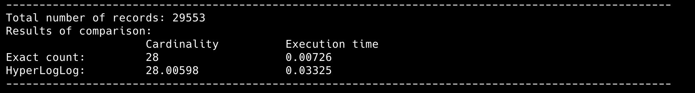

# goit-algo2-hw-05

Design and Analysis of Algorithms: Implemented a Bloom filter for efficient password uniqueness checks. Utilized HyperLogLog to estimate cardinality in Big Data scenarios and compared the results against exact counts for accuracy assessment.

# Task 1.

Results of a Bloom filter realisation for efficient password uniqueness checks.

# Task 2.

Results of cardinality estimation with the help of HyperLogLog algorithm realisation and set exact count.

